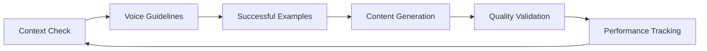
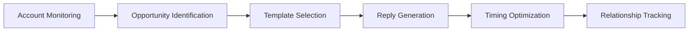
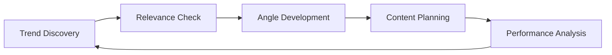

# Context System Integration with Existing Infrastructure

Guide for connecting the new social media context organization with your existing automation scripts and workflows.

## Integration Overview

The context system is designed to work alongside your existing `cheeky-social-media-agent` infrastructure, providing structured context for:
- Content creation workflows
- Reply discovery and generation
- Account targeting and relationship management
- Performance tracking and optimization

## Current Script Integration Points

### Content Generation Scripts

#### `scripts/generate-post.ts`
**Integration Opportunity:** Use context system for consistent voice and strategic alignment
```typescript
// Potential integration points:
// 1. Load voice guidelines from context system
// 2. Reference successful examples for style consistency
// 3. Check mission alignment before generation
// 4. Validate against quality checklist

const voiceGuidelines = loadContextFile('twitter-specific/creation-guidelines/voice-guidelines.md');
const successfulExamples = loadContextFile('twitter-specific/my-content/best-performing/');
const missionContext = loadContextFile('general-context/mission-and-goals/personal-mission.md');
```

#### `scripts/generate-reply.ts`
**Integration Opportunity:** Use reply templates and target account context
```typescript
// Integration points:
// 1. Load reply templates for consistent patterns
// 2. Reference target account engagement history
// 3. Apply voice guidelines for platform-specific tone
// 4. Track reply performance for optimization

const replyTemplates = loadContextFile('twitter-specific/engagement-strategy/reply-templates.md');
const targetAccounts = loadContextFile('general-context/people-and-accounts/');
const engagementHistory = loadContextFile('general-context/people-and-accounts/ai-marketing-peers/');
```

### Discovery and Monitoring Scripts

#### `scripts/enhanced-reply-search.ts`
**Integration Opportunity:** Use target account database for focused discovery
```typescript
// Integration points:
// 1. Load high-priority target accounts from context
// 2. Apply account quality assessment criteria
// 3. Filter based on engagement history and relationship status
// 4. Prioritize signal boosters for immediate engagement

const signalBoosters = loadContextFile('general-context/people-and-accounts/signal-boosters/');
const aiMarketingPeers = loadContextFile('general-context/people-and-accounts/ai-marketing-peers/');
```

#### `scripts/fetch-latest-tweets.ts`
**Integration Opportunity:** Focus monitoring on strategic accounts
```typescript
// Integration points:
// 1. Monitor high-priority accounts from context system
// 2. Track trending topics relevant to your expertise
// 3. Identify content opportunities using research framework
// 4. Alert for immediate response opportunities

const trendingTopics = loadContextFile('general-context/content-research/trending-topics/');
```

## Context-Driven Workflow Enhancements

### 1. Content Creation Pipeline



**Implementation Steps:**
1. **Pre-generation:** Load mission context and voice guidelines
2. **Generation:** Apply platform-specific templates and patterns
3. **Validation:** Check against quality checklist and successful examples
4. **Post-creation:** Track performance and update context as needed

### 2. Engagement Strategy Automation



**Implementation Steps:**
1. **Monitoring:** Track signal boosters and AI marketing peers
2. **Assessment:** Evaluate opportunities using context criteria
3. **Response:** Apply appropriate reply template based on content type
4. **Optimization:** Time responses based on account engagement patterns
5. **Learning:** Update relationship status and engagement history

### 3. Research and Trend Analysis



**Implementation Steps:**
1. **Discovery:** Monitor sources for trending topics in your expertise areas
2. **Filtering:** Apply relevance criteria from content research framework
3. **Analysis:** Develop contrarian angles using your proven patterns
4. **Execution:** Create content using context-driven templates
5. **Learning:** Track performance and refine approach

## Automated Context Updates

### Performance Data Integration
```typescript
// Example: Update best-performing content automatically
const updateBestPerforming = (postMetrics) => {
  if (postMetrics.engagement > THRESHOLD) {
    appendToContextFile('twitter-specific/my-content/best-performing/', {
      content: postMetrics.text,
      performance: postMetrics.engagement,
      analysis: extractPatterns(postMetrics)
    });
  }
};
```

### Relationship Status Tracking
```typescript
// Example: Update account engagement history
const updateEngagementHistory = (accountHandle, interactionData) => {
  const accountFile = `general-context/people-and-accounts/ai-marketing-peers/${accountHandle}.md`;
  updateContextFile(accountFile, {
    lastEngagement: interactionData.date,
    engagementType: interactionData.type,
    performance: interactionData.metrics
  });
};
```

### Trending Topic Detection
```typescript
// Example: Auto-detect trending topics
const detectTrendingTopics = async () => {
  const sources = await monitorSources();
  const relevantTopics = filterByExpertise(sources);
  const opportunities = identifyContentOpportunities(relevantTopics);
  
  updateContextFile('general-context/content-research/trending-topics/current.md', {
    date: new Date(),
    topics: opportunities
  });
};
```

## Context File Access Patterns

### Reading Context
```typescript
// Standard pattern for loading context
const loadContext = (contextPath: string) => {
  const fullPath = `social-media-context/${contextPath}`;
  return parseMarkdownContext(fullPath);
};

// Examples:
const voiceGuidelines = loadContext('twitter-specific/creation-guidelines/voice-guidelines.md');
const targetAccounts = loadContext('general-context/people-and-accounts/signal-boosters/README.md');
const missionContext = loadContext('general-context/mission-and-goals/personal-mission.md');
```

### Updating Context
```typescript
// Standard pattern for updating context files
const updateContext = (contextPath: string, newData: any) => {
  const fullPath = `social-media-context/${contextPath}`;
  const currentContext = loadContext(contextPath);
  const updatedContext = mergeContext(currentContext, newData);
  writeMarkdownContext(fullPath, updatedContext);
};

// Examples:
updateContext('twitter-specific/my-content/best-performing/recent.md', newHighPerformingPost);
updateContext('general-context/people-and-accounts/engagement-history.md', newEngagementData);
```

## Implementation Roadmap

### Phase 1: Core Integration (Week 1-2)
- [ ] Modify `generate-post.ts` to use voice guidelines
- [ ] Update `generate-reply.ts` to use reply templates
- [ ] Integrate target account database with discovery scripts
- [ ] Set up automated performance tracking to context system

### Phase 2: Advanced Automation (Week 3-4)
- [ ] Implement trending topic detection and context updates
- [ ] Add relationship status tracking to engagement scripts
- [ ] Create context-driven content calendar automation
- [ ] Build performance analytics dashboard from context data

### Phase 3: Optimization (Month 2)
- [ ] Machine learning integration for pattern recognition
- [ ] Advanced context correlation analysis
- [ ] Predictive content performance modeling
- [ ] Automated strategy optimization based on context insights

## Benefits of Integration

### 1. Consistency
- Voice guidelines ensure all generated content matches your brand
- Reply templates maintain engagement quality across interactions
- Mission alignment prevents off-brand content creation

### 2. Efficiency
- Structured context eliminates research time for content creation
- Target account database focuses engagement efforts
- Template systems accelerate reply generation

### 3. Learning
- Performance data automatically updates best practices
- Relationship tracking improves engagement strategy
- Trend analysis identifies content opportunities

### 4. Scalability
- Context system grows with your network and content volume
- Automation reduces manual effort while maintaining quality
- Strategic focus ensures efficient resource allocation

## Next Steps

1. **Test Integration:** Start with simple context file loading in existing scripts
2. **Measure Impact:** Compare content performance before/after context integration
3. **Iterate Improvements:** Refine context structure based on automation needs
4. **Scale Gradually:** Add more sophisticated automation as system proves effective 